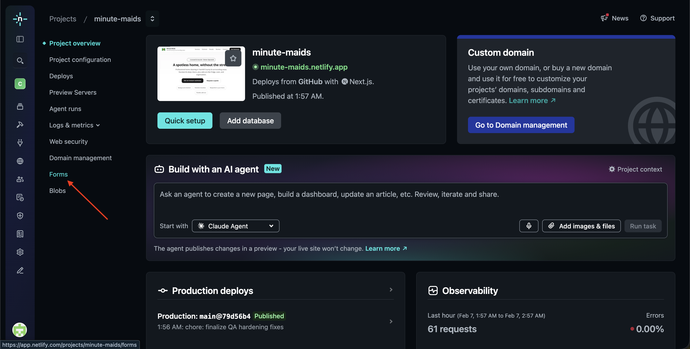
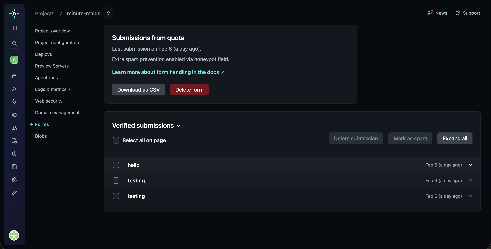

# Minute Maids Website – Handoff Guide

## 1. Overview

Your Minute Maids website is a live, single-page marketing site designed to:

- Introduce your services clearly
- Show trust-building content (results, reviews, FAQ)
- Capture quote requests through the contact form

The website is hosted on **Netlify**.

Once transferred, the website and hosting will be fully in your own Netlify account, which means you will own and control:

- Hosting
- Form submissions (lead inquiries)
- Domain connection settings

You do not need coding knowledge for day-to-day operation (viewing leads, receiving notifications, domain management).

---

## 2. Netlify Account & Site Ownership (Important)

The site will be transferred into your own Netlify account so you have full ownership and control.

### Step 1: Create a Netlify Account

1. Go to: https://app.netlify.com/signup
2. Choose your preferred sign-up option:

- Email
- GitHub
- Google

3. Complete account setup.

[Screenshot Placeholder]

> 📸 **Screenshot:** Netlify signup page showing the “Sign up” options

---

### Step 2: Site Transfer (Performed Together)

1. The developer initiates the transfer from the current Netlify team/account.
2. You receive an email invitation from Netlify.
3. Open the email and click **Accept site transfer**.
4. The site appears in your Netlify dashboard under your account.

[Screenshot Placeholder]

> 📸 **Screenshot:** Netlify email invitation showing “Accept site transfer” button

---

## 3. Viewing Contact Form Submissions (Leads)

All quote/contact requests from the website are captured in **Netlify Forms**.

1. Log in: https://app.netlify.com
2. Open your **Minute Maids** site.
3. Click **Forms** in the left sidebar (site navigation).
4. Select the form named **quote**.
5. View all submissions in the list.

---

## 4. Email Notifications for New Leads

Netlify can automatically email you every time a new form submission is received.

Current Netlify path uses **Configuration** and **Notifications**:

1. Open your site in Netlify.
2. Go to **Configuration** → **Notifications**.
3. In **Form submission notifications**, click **Add notification**.
4. Choose **Email**.
5. Enter your email address.
6. Save.

Tip: You can configure notifications for a specific form (such as **quote**) or for all forms.

[Screenshot Placeholder]

> 📸 **Screenshot:** “Add notification” button in Form submission notifications

[Screenshot Placeholder]

> 📸 **Screenshot:** Email notification configuration panel

---

## 5. Connecting a Custom Domain (When Ready)

Your domain is purchased separately (GoDaddy, Namecheap, Google Domains, etc.).

No site rebuild is needed to connect a domain.

1. Purchase your domain.
2. In Netlify, open your site.
3. Go to **Site configuration** (or **Site settings**) → **Domain management**.
4. Click **Add domain**.
5. Follow Netlify DNS instructions.

[Screenshot Placeholder]

> 📸 **Screenshot:** Netlify “Domain management” page with “Add domain” button

SSL / HTTPS:

- Netlify automatically provisions HTTPS (secure lock icon) after domain setup.

---

## 6. Updating the Valentine’s Special

The Valentine’s promotion assets are file-based:

- Promo image: `/public/images/`
- Flyer PDF: `/public/docs/`

This means updating the special is straightforward and does not require redesigning the site.

For future changes (new promo image, new flyer, updated seasonal campaign), updates can be handled quickly through developer support.

[Screenshot Placeholder]

> 📸 **Screenshot:** File tree showing public/images and public/docs folders

---

## 7. Updating Photos & Reviews (Optional)

- Gallery photos are stored as static image files.
- Reviews are stored in a simple data file used by the site.

These are easy for a developer to update as your business grows. You do not need to edit code directly.

---

## 8. Support & Next Steps

What you can do yourself:

- View leads in **Forms**
- Enable email notifications
- Connect your custom domain when ready

When to request support:

- New promotions/seasonal updates
- Content updates (photos, reviews, service wording)
- Any design or feature enhancements

Status at handoff:

- Site is stable
- Site is live and production-ready
- Netlify Forms are active for quote submissions
- Ownership transfer process is ready as soon as your Netlify account is created

This handoff is designed so you can confidently manage daily operations while keeping technical updates simple to request when needed.
